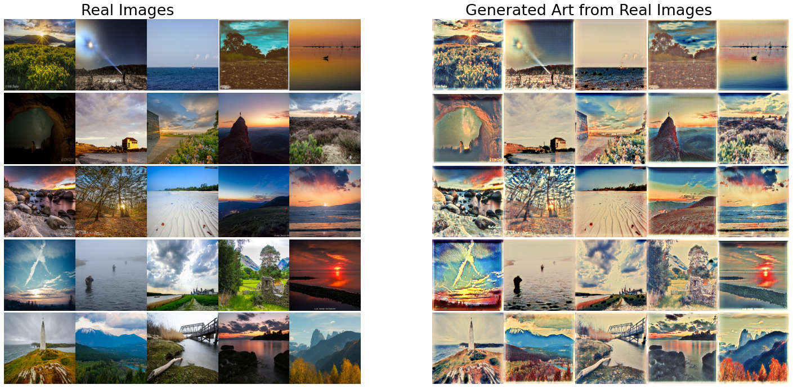

# Generate Ukiyo-e Art Using Cycle GAN

#### The following project generates Ukiyo-e Art images from real images using a Cycle GAN.
 

### The deployed model can be found at : https://ai-4-cycle-gan.herokuapp.com/
 

#### **Cycle GAN Paper :** https://www.cs.cmu.edu/~junyanz/projects/CycleGAN/CycleGAN.pdf
#### **Dataset Used :** https://people.eecs.berkeley.edu/~taesung_park/CycleGAN/datasets/ukiyoe2photo.zip

 

## Cycle GAN Workflow
The following is a glimpse of how the Cycle GAN works.
  

 

## Model Results
The following are the generated Ukiyo-e art images from the model on the corresponding real images.
 

    

    

